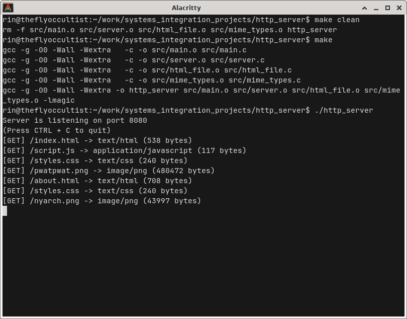

# Simple HTTP Server

The obligatory systems project, a simple HTTP server written in C.
It was developed in a Linux environment, therefore uses POSIX sockets for network operations.



## Project Structure

- `src/server.c`: Contains the socket implementation.
- `src/html_file.c`: A separate program to read / free HTML files from memory.
- `src/mime_types.c`: Using the `magic.h` library, this file allows the server to detect the correct MIME type of a file.
- `src/main.c`: Connects the C files together.
- `public/`: A folder containing a simple HTML / CSS / JS example website. Feel free to replace its contents with your own files.

## Features

- Basic HTTP `GET` request handling
- Support for HTML, CSS and JS files
- Support for multiple routes, and error handling with a 404 page
- Logs served files onto the console

## How to Build

To build the project, run the following command:

```sh
make
```

## How to Run

To run the server, use the following command:

```bash
./http_server
```

In a separate terminal, you can use the following command to test the server:

```sh
curl -v http://localhost:8080
```

And you can also open your browser with the address `http://localhost:8080`.

Finally, you can delete compiled binaries with:

```sh
make clean
```


## License

This project is licensed under the AGPL-3.0 license.
